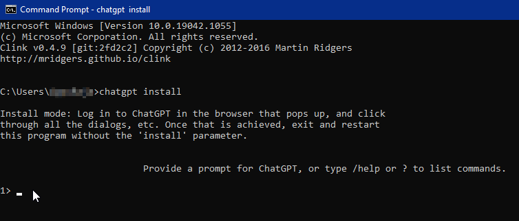
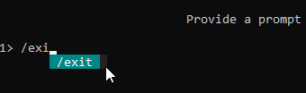
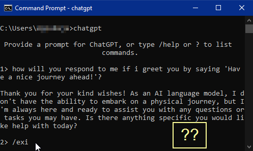
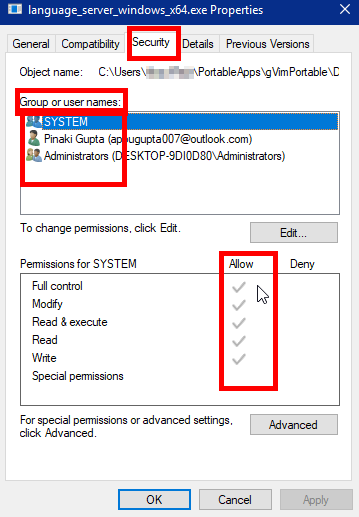
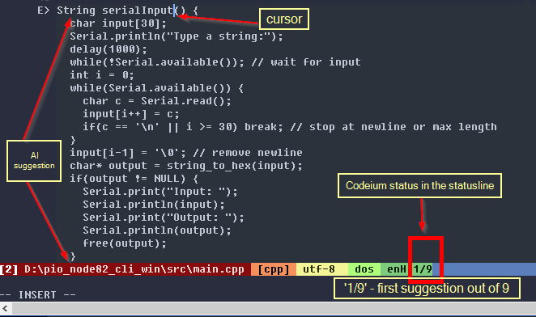

# Power up your Terminal with AI

- [OpenAI](#openai)
  - [Python, pip, and OpenAI Credentials](#python-pip-and-openai-credentials)
  - [Install OpenAI](#install-openai)
  - [The Python Script](#the-python-script)
    - [How will you run this script?](#how-will-you-run-this-script)
- [ChatGPT](#chatgpt)
  - [ChatGPT Wrapper](#chatgpt-wrapper)
    - [Install ChatGPT Wrapper](#install-chatgpt-wrapper)
- [Supercharge your coding experience with AI](#supercharge-your-coding-experience-with-ai)
  - [Codeium Vim Plugin](#codeium-vim-plugin)

There are a lot of (at least two) [OpenAI](https://openai.com/) [ChatGPT](https://chat.openai.com/chat) plugins available for Vim.  Unfortunately, none of them worked as expected on my Microsoft Windows 10 box. That doesn't mean you cannot power your terminal with OpenAI's console applications for finding the right directions with an AI search query. When you code, you spend most of your time on the console. Firing up a Terminal Emulator takes less time and computing resources than opening a browser. Being able to access ChatGPT from the console will save you time, as a plus. Opening a browser, logging into the ChatGPT portal, and creating a new chat thread all of which take time. The command line makes it a breeze in no time.

We will see how to get AI support right into your Terminal Emulator.

## [OpenAI](https://openai.com/)

### Python, pip, and OpenAI Credentials

Create an [OpenAI](https://openai.com/) account (**pro-tip**: register with Google, don't use username/password). Similarly, create a [ChatGPT](https://chat.openai.com/chat) account. Log in to ChatGPT and OpenAI with your Google account. Get your API key from [OpenAI API](https://platform.openai.com/account/api-keys).

Create a file `OpenAI-Codex-API-Key.txt` in your `%USERPROFILE%\Documents` folder to keep your authentication credentials received from [OpenAI Playground](https://platform.openai.com/playground). I assume that you have the latest version of [Python3](https://www.python.org/) installed on your computer. Type `python -V` or `python --version` in your terminal. Check for the later version from https://www.python.org/. Install the `pip` Python package manager on your machine. Look [here](https://www.geeksforgeeks.org/how-to-install-pip-on-windows/) or [here](https://pip.pypa.io/en/stable/installation/) for help. If you have `pip` already installed on your machine, upgrade `pip`.

```
python3.exe -m pip install --upgrade pip
```

Ref: https://stackoverflow.com/questions/57062031/python-m-pip-install-upgrade-pip-does-not-work

If that doesn't work for some reason, download the latest version of `pip` somewhere on the machine and install `pip` from that location. The download link: [pip · PyPI](https://pypi.org/project/pip/#files)

You might have to reinstall `pip`. The command should look somewhat like this:

```
python3.exe -m pip install --force-reinstall pip-23.x.x-py3-none-any.whl
```

### Install OpenAI

```
python3.exe -m pip install openai
```

Or,

```
python3.exe -m pip install openai-cli
```

Ref: https://stackoverflow.com/questions/39832219/pip-not-working-in-python-installation-in-windows-10

If the install process fails:

```
py -m pip install openai
```

Then,

```
python3.exe -m pip install --upgrade openai
```

Or,

```
py -m pip install --upgrade openai
```

Create your OpenAI authentication files.

```
mkdir %USERPROFILE%\.config\openai.token
```

```
mkdir %USERPROFILE%\.config\openaiapirc
```

Fill those files with the API key (token) you received from OpenAI. The key is a long string of texts which looks like `sk-uRUvWX8lwuto5WDLp72QHd8UywehGO9l5RDkLalhYjCDtbWS`.

OpenAI has a tendency to get installed in an odd location. In my case, OpenAI was installed in `C:\msys64\usr\bin\openai`. I saw this when I typed `where openai` (On Linux you have to type: `whereis openai`) and found the result:

```
where openai
C:\msys64\usr\bin\openai
```

OpenAI has already been installed on your system. You can use it directly by typing `C:\msys64\usr\bin>python openai repl --token YOUR-OENAPI-TOKEN` in your MS Windows Terminal. Ask anything, such as requesting OpenAI to write a piece of code. However, this is inconvenient for many reasons (that I don't want to discuss here).

Have a look at https://medium.com/codingthesmartway-com-blog/unleash-the-power-of-openais-chatgpt-api-command-line-conversations-made-easy-with-python-3442e25899fd. The article described a very straightforward way of accessing OpenAI-CLI using a Python script. Here's the python code (An honest disclaimer: I don't understand Python):

### The Python Script

File name:

```
py-chatgpt.py
```

Should be placed inside (a folder):

```
py-chatgpt
```

```python
# -*- coding: latin-1 -*-
# https://stackoverflow.com/questions/58154590/python-syntaxerror-non-utf-8


import openai

# """
# Ecosia: using openai codex from command-line
# Based on:
# https://medium.com/codingthesmartway-com-blog/unleash-the-power-of-openais-chatgpt-api-command-line-conversations-made-easy-with-python-3442e25899fd
# 
# 
# Add this script to your Environment Variable:
# 
# Create a folder
# in your %USERPROFILE% directory and add that folder
# to the System Path.
# E.g., %USERPROFILE%\py-chatgpt
# 
# mkdir %USERPROFILE%\py-chatgpt
# copy "py-chatgpt.py" "%USERPROFILE%\py-chatgpt"
# 
# WINDOWS + r -> systempropertiesadvanced ->
# -> Environment Variables ->
# -> System Variables -> Path -> Edit -> New
# Add
# %USERPROFILE%\py-chatgpt, i.e.,
# C:\Users\YOURUSERNAME\py-chatgpt
# 
# Alternative Method:
# 
# Open CMD in Admin mode:
# 1. Windows Key + r (Run Prompt)
# 2. Type cmd
# 3. CTRL+SHIFT+ENTER
# rundll32.exe sysdm.cpl,EditEnvironmentVariables
# Or,
# rundll32.exe shell32.dll,Control_RunDLL sysdm.cpl,,3
# 
# https://appuals.com/how-to-edit-environment-variables-in-windows-10/
# https://www.autohotkey.com/board/topic/68086-open-the-environment-variable-editing-window/
# 
# Environment Variables ->
# -> System Variables -> Path -> Edit -> New
# Add
# %USERPROFILE%\py-chatgpt, i.e.,
# C:\Users\YOURUSERNAME\py-chatgpt
# 
# Run,
# py-chatgpt
# 
# """

"""
Get your OpenAI API Key.
IMPORTANT: Do not share the TOKEN with anybody else!!
"""

# openai.api_key = "[INSERT YOU OPENAI API KEY HERE]"
# Example:
openai.api_key = "sk-uRUvWX8lwuto5WDLp72QHd8UywehGO9l5RDkLalhYjCDtbWS"


history = []

while True:
    user_input = input("Your input: ")

    messages = []
    for input_text, completion_text in history:
        messages.append({"role": "user", "content": input_text})
        messages.append({"role": "assistant", "content": completion_text})

    messages.append({"role": "user", "content": user_input})

    completion = openai.ChatCompletion.create(
        model="gpt-3.5-turbo", # https://platform.openai.com/docs/models
        messages=messages
    )

    completion_text = completion.choices[0].message.content
    print(completion_text)

    history.append((user_input, completion_text))

    user_input = input("Would you like to continue the conversation? (Y/N) ")
    if user_input.upper() == "N":
        break
    elif user_input.upper() != "Y":
        print("Invalid input. Please enter 'Y' or 'N'.")
        break


"""
EXPLANATION:

Here's a breakdown of the code:

    The first line imports the OpenAI library.
    The second line sets the OpenAI API key to a value that the user needs to insert (retrieved from the OpenAI dashboard, as described above)
    The history variable is initialized as an empty list. This list will be used to store the conversation history.
    The code then enters an infinite loop using the while True statement.
    The input() function prompts the user to enter their input, which is then stored in the user_input variable.
    The messages list is initialized as an empty list. It is used to store the messages exchanged between the user and the chatbot.
    A for loop is used to iterate through the conversation history stored in the history list. The loop appends each message to the messages list in the correct order, with user messages followed by chatbot responses.
    The user's latest message is then added to the messages list.
    The openai.ChatCompletion.create() method is called to generate a response from the chatbot. The method takes two arguments: the GPT-3 model to use ("gpt-3.5-turbo" in this case) and the list of messages exchanged so far (messages). The gpt-3.5-turbo model is the language model which is also used by ChatGPT.
    The response generated by the chatbot is stored in the completion_text variable.
    The chatbot's response is printed to the console using the print() function.
    The latest message exchanged between the user and chatbot is appended to the history list.
    The user is prompted to decide whether to continue or end the conversation using the input() function. The user's response is stored in the user_input variable.
    If the user inputs "N" (case insensitive), the break statement exits the loop and the program ends.
    If the user inputs anything other than "Y" or "N", an error message is printed and the break statement exits the loop and the program ends.

Run the Application:

py-chatgpt

Or,

py-chatgpt.py
"""
```

You will have to make it (the above script) accessible.

Create a folder in your `%USERPROFILE%` directory and add that folder to the System Path. E.g., `%USERPROFILE%\py-chatgpt`.

```
mkdir %USERPROFILE%\py-chatgpt
```

Copy the script `py-chatgpt.py` to `%USERPROFILE%\py-chatgpt`.

```
copy "py-chatgpt.py" "%USERPROFILE%\py-chatgpt"
```

Add the folder `%USERPROFILE%\py-chatgpt` to your Environment Variable (System Path).

`WINDOWS+r` -> Type `cmd` -> Press `CTRL+SHIFT+ENTER` simultaneously (running `CMD.EXE` in Administrator mode).

Type into the terminal:

```
rundll32.exe sysdm.cpl,EditEnvironmentVariables
```

Go to `Environment Variables` -> `System Variables` -> `Path` -> `Edit` -> `New`

Then, add

`%USERPROFILE%\py-chatgpt`, i.e., `C:\Users\YOURUSERNAME\py-chatgpt` to the field.

#### How will you run this script?

```
py-chatgpt
```

Or,

```
py-chatgpt.py
```

---

## [ChatGPT](https://chat.openai.com/chat)

### [ChatGPT Wrapper](https://github.com/mmabrouk/chatgpt-wrapper)

First things first:

Ref: https://stackoverflow.com/questions/68333213/display-a-warning-when-trying-to-install-python-packages

Start your MS Windows Terminal `CMD.EXE` in **Admin** mode.

`WINDOWS+r` -> Type `cmd` -> Press `CTRL+SHIFT+ENTER` simultaneously (running `CMD.EXE` in Administrator mode).

Leave it open in the background even when you don't need it.

```
py -m pip install pip-run
```

The above command is useful when the `pip` Python package manager cannot write files to the drive. Run it, since it doesn't hurt.

### Install [ChatGPT Wrapper](https://github.com/mmabrouk/chatgpt-wrapper.git)

```
py -m pip install git+https://github.com/mmabrouk/chatgpt-wrapper
```

Install some dependencies:

```
py -m pip install setuptools
```

Install Playwright. https://learn.microsoft.com/en-us/microsoft-edge/playwright/

What is Playwright?

According to Microsoft:

"The Playwright library provides cross-browser automation through a single API.

[Playwright](https://playwright.dev/docs/intro) is a [Node.js](https://nodejs.org) library to automate [Chromium](https://www.chromium.org/Home), [Firefox](https://www.mozilla.org/firefox), and [WebKit](https://webkit.org) with a single API. Playwright is built to enable cross-browser web automation that is evergreen, capable, reliable, and fast."

```
npm install npx playwright install firefox
```

If something goes wrong:

```
npx playwright install
```

Then,

```
npm install npx playwright install
```

Then,

```
npm install npx playwright install firefox
```

You'll need Playwright in the background to send and receive data to and fro from the Terminal Emulator to the Playwright (here, a version of Firefox) Browser.

Add Playwright's install directory to your antivirus program's exception list.

Avast's List of Exceptions/Exclusion: `%LOCALAPPDATA%\ms-playwright\*`

Register your ChatGPT-CLI instance:

This time you'll be launching ChatGPT-CLI for the first time to log in to your ChatGPT account using the Playwright browser. The browser will remember your credentials, and you'll be able to access ChatGPT from your Terminal Emulator.

```
chatgpt install
```

Log in to your ChatGPT account. Do not log out ever.


Keep the browser open in the background.



In your terminal, type:



```
/exit
```

From now on, you won't have to type `chatgpt install` every time you access ChatGPT from your Terminal Emulator. Type `chatgpt`. Your credentials are saved Simple!

Type `exit` again to exit the Terminal Emulator.

Fire up the Terminal Emulator again, this time, without launching it in Admin mode. Just run `cmd` as usual.

Access ChatGPT-CLI:

```
chatgpt
```

Wait for a few seconds. Ask ChatGPT waht you hae in mind. ChatGPT will not only provide you with the answer but also save your conversations in your ChatGPT portal that you can access later from your browser.

```
C:\Users\XXXXXXXX>chatgpt

                          Provide a prompt for ChatGPT, or type /help or ? to list commands.

1> please write a simple platformio sketch.


As an AI language model, I am not capable of writing a physical sketch. However, I can provide you with an example code for PlatformIO that you can use as a reference.

Here is a simple code that blinks an LED connected to pin 13 of an Arduino board:

'''C++
#include <Arduino.h>

const int LED_PIN = 13;

void setup() {
  pinMode(LED_PIN, OUTPUT);
}

void loop() {
  digitalWrite(LED_PIN, HIGH); // turn the LED on
  delay(1000);                // wait for a second
  digitalWrite(LED_PIN, LOW);  // turn the LED off
  delay(1000);                // wait for a second
}
'''

This code includes the necessary libraries and defines a constant for the LED pin. In the `setup()` function, the LED pin is set as an output. In the `loop()` function, the LED is turned on and off in one-second intervals using `digitalWrite()` and `delay()`. You can upload this code to your Arduino board using the PlatformIO IDE or CLI.

2> i'm using an esp8266 nodemcu board. instead of lighting up the LED at pin number 13, please light up the built-in LE
D in nodemcu.

Sure! Here's an example code that blinks the built-in LED on a NodeMCU ESP8266 board:

'''C++
#include <Arduino.h>

const int LED_PIN = LED_BUILTIN;

void setup() {
  pinMode(LED_PIN, OUTPUT);
}

void loop() {
  digitalWrite(LED_PIN, HIGH); // turn the LED on
  delay(1000);                // wait for a second
  digitalWrite(LED_PIN, LOW);  // turn the LED off
  delay(1000);                // wait for a second
}
'''

In this code, we use the `LED_BUILTIN` constant to reference the built-in LED pin on the NodeMCU board. In the `setup()` function, we set the LED pin as an output. In the `loop()` function, we blink the LED on and off using `digitalWrite()` and `delay()`.

You can upload this code to your NodeMCU ESP8266 board using the PlatformIO IDE or CLI.

3> thanks! i'll be back soon. bye!

You're welcome! Feel free to ask if you have any more questions. Goodbye!

4> /exit
GoodBye!

C:\Users\XXXXXXXX>
```

OpenAI CLI:

```
C:\Users\XXXXXXXX>py-chatgpt
Your input: should i use four LEDs to make a bridge rectifier?


As an AI language model, I don't have personal preferences or opinions as humans do, but I can provide you with factual information that could help you make an informed decision.

Using four LEDs to create a bridge rectifier may be possible, but not reliable or efficient. LEDs are designed to emit light and not to handle high currents or voltage levels. A bridge rectifier circuit requires four rectifying diodes that can handle the incoming AC voltage safely and efficiently.

Therefore, if you want to create an effective and reliable bridge rectifier, it is recommended to use four rectifying diodes instead of LEDs. You may consult an expert if you're unsure how to proceed.
Would you like to continue the conversation? (Y/N) n

C:\Users\XXXXXXXX>
```

Now, ChatGPT and OpenAI are there right in your Terminal Emulator. It's up to you to make the output usable to the maximum extent possible. Since,

> Plagiarism plagues when one entirely parrots a book, whereas conducting research involves selecting essential information from multiple sources.
> 
> -- Author unknown



# Supercharge your coding experience with AI

## [Codeium](https://codeium.com/) Vim Plugin

According to some people, for a truly uncompromised AI-powered autocompletion there's no true alternative to GitHub's Copilot. I didn't have the luck to try Copilot, but Copilot has made its place. Those who didn't want a solution locked behind a paywall started to find an alternative ever since the inception of GitHub Copilot. Luckily we have no reason to lose hope. A similar, very close to Copilot alternative is out there.

Codeium.

Codeium works with all major text editors and IDEs. Vim is one of the supported platforms. It is free forever (as promised), at least for early birds.

Here's how to set it up on your MS Windows machine. I'll not leave the plugin settings turned on since I haven't tested it on Linux yet. Also, some people may prefer other alternatives. Codeium may charge users in the future. Speculations are galore! However, if you want to try Codeium with Vim on your machine right now, please keep reading.

Uncomment the following lines from your `.vimrc2.vim`. Use your editor's search and replace feature for that.

```
"     set statusline+=%3{codeium#GetStatusString()}             "Codeium: https://codeium.com/
```

```
"Plug 'Exafunction/codeium.vim'
"            C              " Close to GitHub Copilot
"            o            AI Supercharged autocompetion
"            d            Infuse AI into your codeing
"            ium          https://codeium.com/vim_tutorial
```

```
" -----------------------------------------
" Codeium Plugin Settings
"let g:codeium_filetypes = {
"    \ "c": v:false,
"    \ "typescript": v:true,
"    \ "python": v:true,
"    \ "cpp": v:true,
"    \ "rust": v:true,
"    \ }
" -----------------------------------------
```

So that the lines become:

```
set statusline+=%3{codeium#GetStatusString()}             "Codeium: https://codeium.com/
```

```
Plug 'Exafunction/codeium.vim'
"            C              " Close to GitHub Copilot
"            o            AI Supercharged autocompetion
"            d            Infuse AI into your codeing
"            ium          https://codeium.com/vim_tutorial
```

```
" -----------------------------------------
" Codeium Plugin Settings
let g:codeium_filetypes = {
    \ "c": v:false,
    \ "typescript": v:true,
    \ "python": v:true,
    \ "cpp": v:true,
    \ "rust": v:true,
    \ }
" -----------------------------------------
```

Fire up gVim/Vim in Admin Mode (R-Click and choose to Run as Administrator). In the Command Mode (hit `Esc`), type:

```
PlugInstall
```

To install the plugin.

The  plugin comes with some quirks, so a few weird steps are involved. The Admin mode was the first of them. I use a portable Vim installation. Update portable gVim (or the regular one) to the latest version. Get it from [here](https://github.com/vim/vim-win32-installer).

1. Delete the `%USERPROFILE%\PortableApps\gVimPortable\Data\settings\.codeium` and the `%USERPROFILE%\PortableApps\gVimPortable\Data\settings\.vim\plugged\codeium.vim` folder if those folders already exist.

2. Run `:PluInstall` and then `:PlugUpdate`.

3. Add `%USERPROFILE%\PortableApps\gVimPortable\Data\settings\` to Avast's (or any other antivirus program's) list of exceptions.

4. Exit Vim.

5. If you do not follow the steps I'll mention, you'll get authentication errors because the plugin will say that it cannot access a temp file located in `%USERPROFILE%\PortableApps\gVimPortable\Data\Temp\`.

6. Extract the file `language_server_windows_x64.exe.gz` found in `%USERPROFILE%\PortableApps\gVimPortable\Data\settings\.codeium\bin\c783d097d5521079d55284594e15f8f8fc38adbb`. Now the folder should contain `language_server_windows_x64.exe`. Change the permission parameters of that executable file.
   
   

7. You're ready to go with AI. Type a function, variable etc. in the Insert Mode (hit `i`) and press `M+]` (that is, `LEFT_ALT + ]`), and you'll see how it performs.
   
   
   
   For more information, look at
   
   [Vim / Neovim Tutorial | Codeium](https://codeium.com/vim_tutorial)
   
   And
   
   https://github.com/Exafunction/codeium.vim.
