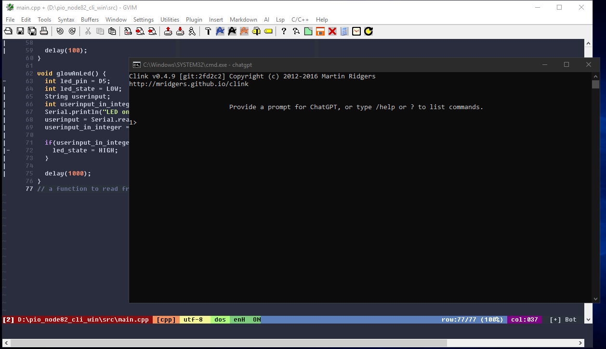

# Power up your Terminal with AI

- [Bard](#bard-rs)
  - [Install dependencies](#install-dependencies)
  - [Install or re-install Rust](#install-or-re-install-rust)
  - [Get the session cookie](#get-the-session-cookie)
  - [Prepare the Google Bard CLI](#prepare-the-google-bard-cli)
  - [Find the conversation history as a Markdown file](#find-the-conversation-history-as-a-markdown-file)
  - [Commands](#commands)
  - [Configure SHELL utilities](#configure-shell-utilities)
  - [Install the script](#install-the-script)
  - [Run the program](#run-the-program)
- [OpenAI](#openai)
  - [Python, pip, and OpenAI Credentials](#python-pip-and-openai-credentials)
  - [Install OpenAI](#install-openai)
  - [The Python Script](#the-python-script)
    - [How will you run this script?](#how-will-you-run-this-script)
- [ChatGPT](#chatgpt)
  - [ChatGPT Wrapper](#chatgpt-wrapper)
    - [Install ChatGPT Wrapper](#install-chatgpt-wrapper)
  - [ChatGPT can be accessed from Vim's GUI](#chatgpt-vim-gui)
- [Supercharge your coding experience with AI](#supercharge-your-coding-experience-with-ai)
  - [Codeium Vim Plugin](#codeium-vim-plugin)
  - [Codeium Keybindings](#codeium-keybindings)
- [Cursor AI Editor](#cursor-ai-editor)

There are a lot of (at least two) [OpenAI](https://openai.com/) [ChatGPT](https://chat.openai.com/chat) plugins available for Vim.  Unfortunately, none of them worked as expected on my Microsoft Windows 10 box. That doesn't mean you cannot power your terminal with OpenAI's console applications for finding the right directions with an AI search query. When you code, you spend most of your time on the console. Firing up a Terminal Emulator takes less time and computing resources than opening a browser. Being able to access ChatGPT from the console will save you time, as a plus. Opening a browser, logging into the ChatGPT portal, and creating a new chat thread all of which take time. The command line makes it a breeze in no time.

We will see how to get AI support right into your Terminal Emulator.

## [bard-rs](https://lib.rs/crates/bard-rs):

_Google Bard CLI_

Google Bard in the command line.

### Install dependencies:

https://github.com/rust-lang/cargo/issues/174

Cargo-build will fail without it.

```
sudo apt install libssl-dev
```

NOTE: I didn't have to install 'libssl' on my Windows box in the presence of my MSYS2 setup. Your mileage may vary.

## Install or re-install Rust (if you already have Rust on your machine): <a name="install-or-re-install-rust"></a>

```
curl --proto '=https' --tlsv1.2 -sSf https://sh.rustup.rs | sh
```

```
source "$HOME/.cargo/env"
```

**MS Windows:**

Open the MSYS2 shell.

Update the existing MSYS2 installation.

```
pacman -Syu
```

If Rust is already installed on the system, everything, including Rust and Cargo, will be updated to the latest version.

If you haven't installed Rust and Cargo yet, refer to the [README](https://github.com/Pinaki82/Tulu-C-IDE/blob/main/README.md) of [Tulu-C-IDE](https://github.com/Pinaki82/Tulu-C-IDE.git).

Usually, the commands are:

```
pacman -S mingw-w64-x86_64-rust
```

```
pacman -S mingw-w64-x86_64-cargo-c
```

## Install [bard-rs](https://lib.rs/crates/bard-rs)

```
cargo install bard-rs
```

### Before using the Google Bard CLI, you need to obtain your session cookie. To get the session cookie, follow these steps: <a name="get-the-session-cookie"></a>

1. Go to [Google Bard](https://bard.google.com/) in Firefox.

2. Open Firefox Developer Tools (Ctrl + Shift + i).

3. Go to the "Storage" tab.

4. Under "Storage" > "Cookies", click on "https://bard.google.com".

Find the cookie with the name `__Secure-1PSID`, and copy its value. (It is found within "." usually). Example: `__Secure-1PSID:"WgRg4O3Y2Wy0PnDYB0CFTjBCfIgft8SwtLtcZYvoKyDC-pVW9QL1aFNWiOsDXQDdxc_Yuw."`.


R-click and copy the ID value to clipboard.


## Prepare the Google Bard CLI:

Supported options: `-s` (session cookie), `-m` (if present, it'll print other Bard's responses for your prompt), `-p` (if present with path, it'll save your chat history as markdown.), `-e` (if present with `.env` file location, it'll use that session cookie)

The `.env` file will be helpful in particular. Once you create this file, you'll be able to use the program without manually entering you session ID.

```
__Secure-1PSID:"WgRg4O3Y2Wy0PnDYB0CFTjBCfIgft8SwtLtcZYvoKyDC-pVW9QL1aFNWiOsDXQDdxc_Yuw."
```

Of which, you'll need the part below:

```
WgRg4O3Y2Wy0PnDYB0CFTjBCfIgft8SwtLtcZYvoKyDC-pVW9QL1aFNWiOsDXQDdxc_Yuw.
```

Run the CLI program for testing: `bard-rs --session WgRg4O3Y2Wy0PnDYB0CFTjBCfIgft8SwtLtcZYvoKyDC-pVW9QL1aFNWiOsDXQDdxc_Yuw. --path ./`

Create a key file that will be accessed by `bard-rs` so that you won't have to type the ID every time you open the program: `echo SESSION_ID=WgRg4O3Y2Wy0PnDYB0CFTjBCfIgft8SwtLtcZYvoKyDC-pVW9QL1aFNWiOsDXQDdxc_Yuw. > .env`.

Test again, without passing the session ID:

```
bard-rs -m -e .env -p ./
```

Ask something.

Exit.

```
!exit
```

**MS Windows:**

Fire up your Windows Terminal (CMD.EXE). Do not run the command prompt in administrator mode. Run it normally. You will see your username when you launch `cmd` normally, `C:\Users\YOUR_USERNAME>`. 

Run CMD.EXE:

`WINDOWS+r` -> `cmd` -> `Enter`.

Install the [bard-rs](https://lib.rs/crates/bard-rs) package from Rust's package manager Cargo. Type the following into the command prompt and hit Enter.

```
cargo install bard-rs
```

Wait a few minutes, [bard-rs](https://lib.rs/crates/bard-rs) will be built and ready.

Let's assume that your Bard session ID is `__Secure-1PSID:"WxxxxxxxxxxxxxxxxxxxxxxxxxxxxxxA."` on the Windows machine, so you'll need to take note of the part `WxxxxxxxxxxxxxxxxxxxxxxxxxxxxxxA.`.

Test Bard:

`bard-rs --session WxxxxxxxxxxxxxxxxxxxxxxxxxxxxxxA.  --path ./`

Run `CMD.EXE` again, this time in **administrator** mode.

`WINDOWS+r` -> `cmd` -> `CTRL+SHIFT+ENTER`.

You won't see your username here. The command prompt will show its current working directory as `C:\Windows\system32>` rather than your `%USERPROFILE%`.

```
C:\Windows\system32>
```

Go to the system's root directory.

```
cd C:\
```

Create a file `.env` there.

```
notepad .env
```

Fill the file with your Bard session ID followed by `SESSION_ID=`, as shown below:

```
SESSION_ID=WxxxxxxxxxxxxxxxxxxxxxxxxxxxxxxA.
```

Exit the command prompt.

```
exit
```

Run the command prompt in normal mode as usual, `WINDOWS+r` -> `cmd`.

`cmd` will show its current working directory `C:\Users\YOUR_USERNAME>`.

Type `bard-rs -m -e .env -p ./` and ask questions.

```
bard-rs -m -e .env -p ./
```

On MS Windows, the conversation history will be saved into `%USERPROFILE%`.

In the command prompt, `explorer %USERPROFILE%`, or at the address bar of Windows Explorer (File Manager) `%USERPROFILE%` and `Enter`.

NOTE: You'll have to switch to a location somewhere in the system drive (`C:\`) to use [bard-rs](https://lib.rs/crates/bard-rs). If you are on a different drive, type `C:` and hit `Enter` to switch.

Exit [bard-rs](https://lib.rs/crates/bard-rs) CLI: `!exit`.

### Linux: Find the conversation history as a Markdown file in `~/` <a name="find-the-conversation-history-as-a-markdown-file"></a>

### Commands:

Type your message and press `Enter` to send it to Google Bard.

Type `!reset` to reset the conversation.

Type `!exit` to exit the CLI.

Type `!show` to see other Bard's answers for your last message.

**Create a shell script for easy access on Linux:**

Create a shell script for easy access with the command you used: `bard-rs -m -e .env -p ./`.

File: `bard` (not `bard.sh` in this case).

```
cd ~/
```

```
touch bard
```

```
nano bard
```

Paste the following (usually, CTRL+SHIFT+v):

```
#!/bin/bash

bard-rs -m -e .env -p ./ \
```

Or, find the script in this directory's root.

**MS Windows:** Create a launcher script:

Run the command prompt in **admin** mode, `WINDOWS+r` -> `cmd` -> `CTRL+SHIFT+ENTER`.

Create a folder `bard-cli` at the root of your `C:\` drive.

```
mkdir bard-cli
```

Go inside that directory and create the launcher script.

```
notepad bard.CMD
```

Fill the file with the following (do not put anything more than this):

```
bard-rs -m -e .env -p ./
```

Exit the command prompt.

```
exit
```

**Add this `bard-rs` folder to the system's search PATH Environment:**

Run Launcer (`WINDOWS+r`) -> `systempropertiesadvanced` -> Advanced Tab -> Environment Variables Button -> 'System variables' section -> Path - Edit... -> New.

Paste `C:\bard-cli` -> `OK` -> `OK` -> `OK`.

Run [bard-rs](https://lib.rs/crates/bard-rs).

```
bard
```

### Configure SHELL utilities before installing the  `bard` script: <a name="configure-shell-utilities"></a>

BASH Shell:

Open `$HOME/.bashrc` or `$HOME/.bash_aliases` with a text editor and paste the following line in the beginning:

```
export PATH="$HOME/.local/bin/:$PATH"
```

Reload the BASH configuration:

```
source .bashrc
```

```
source .bash_aliases
```

Fish Shell:

Open `$HOME/.config/fish/config.fish` with a text editor and paste the following lines in the beginning:

```
# --------------

# $HOME/.local/bin

export PATH="$HOME/.local/bin/:$PATH"
export PATH

# --------------
```

Run: `source $HOME/.config/fish/config.fish` to reload the configuration.

## Install the script:

```
chmod +x bard
```

```
install -m 755 bard $HOME/.local/bin
```

`755` means permission for read+write+execute.

Go to `~/.local/bin/` and see the file and related permission parameters from the GUI file manager if you prefer.

## Run the program:

```
bard
```

## [OpenAI](https://openai.com/)

### Python, pip, and OpenAI Credentials

Create an [OpenAI](https://openai.com/) account (**pro-tip**: register with Google, don't use username/password). Similarly, create a [ChatGPT](https://chat.openai.com/chat) account. Log in to ChatGPT and OpenAI with your Google account. Get your API key from [OpenAI API](https://platform.openai.com/account/api-keys).

Create a file `OpenAI-Codex-API-Key.txt` in your `%USERPROFILE%\Documents` folder to keep your authentication credentials received from [OpenAI Playground](https://platform.openai.com/playground). I assume that you have the latest version of [Python3](https://www.python.org/) installed on your computer. Type `python -V` or `python --version` in your terminal. Check for the later version from https://www.python.org/. Install the `pip` Python package manager on your machine. Look [here](https://www.geeksforgeeks.org/how-to-install-pip-on-windows/) or [here](https://pip.pypa.io/en/stable/installation/) for help. If you have `pip` already installed on your machine, upgrade `pip`.

```
python3.exe -m pip install --upgrade pip
```

Ubuntu:

```
cd ~/
```

```
python3 -m pip install --upgrade pip
```

Ref: https://stackoverflow.com/questions/57062031/python-m-pip-install-upgrade-pip-does-not-work

If that doesn't work for some reason, download the latest version of `pip` somewhere on the machine and install `pip` from that location. The download link: [pip · PyPI](https://pypi.org/project/pip/#files)

You might have to reinstall `pip`. The command should look somewhat like this:

```
python3.exe -m pip install --force-reinstall pip-23.x.x-py3-none-any.whl
```

### Install OpenAI

```
python3.exe -m pip install openai
```

Or,

```
python3.exe -m pip install openai-cli
```

Ubuntu:

```
python3 -m pip install openai
```

Ref: https://stackoverflow.com/questions/39832219/pip-not-working-in-python-installation-in-windows-10

If the install process fails:

```
py -m pip install openai
```

Then,

```
python3.exe -m pip install --upgrade openai
```

Or,

```
py -m pip install --upgrade openai
```

Create your OpenAI authentication files.

```
mkdir %USERPROFILE%\.config
```

```
notepad %USERPROFILE%\.config\openai.token
```

```
notepad %USERPROFILE%\.config\openaiapirc
```

Ubuntu:

```
touch ~/.config/openai.token
```

```
touch ~/.config/openaiapirc
```

```
mousepad ~/.config/openai.token
```

```
mousepad ~/.config/openaiapirc
```

Fill those files with the API key (token) you received from OpenAI. The key is a long string of texts which looks like `sk-uRUvWX8lwuto5WDLp72QHd8UywehGO9l5RDkLalhYjCDtbWS`.

OpenAI has a tendency to get installed in an odd location. In my case, OpenAI was installed in `C:\msys64\usr\bin\openai`. I saw this when I typed `where openai` (On Linux you have to type: `whereis openai`) and found the result:

```
where openai
C:\msys64\usr\bin\openai
```

OpenAI has already been installed on your system. You can use it directly by typing `C:\msys64\usr\bin>python openai repl --token YOUR-OENAPI-TOKEN` in your MS Windows Terminal. Ask anything, such as requesting OpenAI to write a piece of code. However, this is inconvenient for many reasons (that I don't want to discuss here).

Have a look at https://medium.com/codingthesmartway-com-blog/unleash-the-power-of-openais-chatgpt-api-command-line-conversations-made-easy-with-python-3442e25899fd. The article described a very straightforward way of accessing OpenAI-CLI using a Python script. Here's the python code (An honest disclaimer: I don't understand Python):

### The Python Script

File name:

```
py-chatgpt.py
```

Should be placed inside (a folder):

```
py-chatgpt
```

```python
# -*- coding: latin-1 -*-
# https://stackoverflow.com/questions/58154590/python-syntaxerror-non-utf-8


import openai

# """
# Ecosia: using openai codex from command-line
# Based on:
# https://medium.com/codingthesmartway-com-blog/unleash-the-power-of-openais-chatgpt-api-command-line-conversations-made-easy-with-python-3442e25899fd
#
#
# Add this script to your Environment Variable:
#
# Create a folder
# in your %USERPROFILE% directory and add that folder
# to the System Path.
# E.g., %USERPROFILE%\py-chatgpt
#
# mkdir %USERPROFILE%\py-chatgpt
# copy "py-chatgpt.py" "%USERPROFILE%\py-chatgpt"
#
# WINDOWS + r -> systempropertiesadvanced ->
# -> Environment Variables ->
# -> System Variables -> Path -> Edit -> New
# Add
# %USERPROFILE%\py-chatgpt, i.e.,
# C:\Users\YOURUSERNAME\py-chatgpt
#
# Alternative Method:
#
# Open CMD in Admin mode:
# 1. Windows Key + r (Run Prompt)
# 2. Type cmd
# 3. CTRL+SHIFT+ENTER
# rundll32.exe sysdm.cpl,EditEnvironmentVariables
# Or,
# rundll32.exe shell32.dll,Control_RunDLL sysdm.cpl,,3
#
# https://appuals.com/how-to-edit-environment-variables-in-windows-10/
# https://www.autohotkey.com/board/topic/68086-open-the-environment-variable-editing-window/
#
# Environment Variables ->
# -> System Variables -> Path -> Edit -> New
# Add
# %USERPROFILE%\py-chatgpt, i.e.,
# C:\Users\YOURUSERNAME\py-chatgpt
#
# Run,
# py-chatgpt
#
# """

"""
Get your OpenAI API Key.
IMPORTANT: Do not share the TOKEN with anybody else!!
"""

# openai.api_key = "[INSERT YOU OPENAI API KEY HERE]"
# Example:
openai.api_key = "sk-uRUvWX8lwuto5WDLp72QHd8UywehGO9l5RDkLalhYjCDtbWS"


history = []

while True:
    user_input = input("Your input: ")

    messages = []
    for input_text, completion_text in history:
        messages.append({"role": "user", "content": input_text})
        messages.append({"role": "assistant", "content": completion_text})

    messages.append({"role": "user", "content": user_input})

    completion = openai.ChatCompletion.create(
        model="gpt-3.5-turbo", # https://platform.openai.com/docs/models
        messages=messages
    )

    completion_text = completion.choices[0].message.content
    print(completion_text)

    history.append((user_input, completion_text))

    user_input = input("Would you like to continue the conversation? (Y/N) ")
    if user_input.upper() == "N":
        break
    elif user_input.upper() != "Y":
        print("Invalid input. Please enter 'Y' or 'N'.")
        break


"""
EXPLANATION:

Here's a breakdown of the code:

    The first line imports the OpenAI library.
    The second line sets the OpenAI API key to a value that the user needs to insert (retrieved from the OpenAI dashboard, as described above)
    The history variable is initialized as an empty list. This list will be used to store the conversation history.
    The code then enters an infinite loop using the while True statement.
    The input() function prompts the user to enter their input, which is then stored in the user_input variable.
    The messages list is initialized as an empty list. It is used to store the messages exchanged between the user and the chatbot.
    A for loop is used to iterate through the conversation history stored in the history list. The loop appends each message to the messages list in the correct order, with user messages followed by chatbot responses.
    The user's latest message is then added to the messages list.
    The openai.ChatCompletion.create() method is called to generate a response from the chatbot. The method takes two arguments: the GPT-3 model to use ("gpt-3.5-turbo" in this case) and the list of messages exchanged so far (messages). The gpt-3.5-turbo model is the language model which is also used by ChatGPT.
    The response generated by the chatbot is stored in the completion_text variable.
    The chatbot's response is printed to the console using the print() function.
    The latest message exchanged between the user and chatbot is appended to the history list.
    The user is prompted to decide whether to continue or end the conversation using the input() function. The user's response is stored in the user_input variable.
    If the user inputs "N" (case insensitive), the break statement exits the loop and the program ends.
    If the user inputs anything other than "Y" or "N", an error message is printed and the break statement exits the loop and the program ends.

Run the Application:

py-chatgpt

Or,

py-chatgpt.py
"""
```

You will have to make it (the above script) accessible.

Create a folder in your `%USERPROFILE%` directory and add that folder to the System Path. E.g., `%USERPROFILE%\py-chatgpt`.

```
mkdir %USERPROFILE%\py-chatgpt
```

Copy the script `py-chatgpt.py` to `%USERPROFILE%\py-chatgpt`.

```
copy "py-chatgpt.py" "%USERPROFILE%\py-chatgpt"
```

Add the folder `%USERPROFILE%\py-chatgpt` to your Environment Variable (System Path).

`WINDOWS+r` -> Type `cmd` -> Press `CTRL+SHIFT+ENTER` simultaneously (running `CMD.EXE` in Administrator mode).

Type into the terminal:

```
rundll32.exe sysdm.cpl,EditEnvironmentVariables
```

Go to `Environment Variables` -> `System Variables` -> `Path` -> `Edit` -> `New`

Then, add

`%USERPROFILE%\py-chatgpt`, i.e., `C:\Users\YOURUSERNAME\py-chatgpt` to the field.

Ubuntu:

```
mkdir ~/.local/bin
```

```
cp py-chatgpt.py ~/.local/bin/
```

```
chmod +x $HOME/.local/bin/py-chatgpt.py
```

Or,

```
chmod +x ~/.local/bin/py-chatgpt.py
```

```
mousepad ~/.bash_aliases
```

Or,

```
mousepad ~/.bashrc
```

Bash alias:

```
alias py-chatgpt='python3 $HOME/.local/bin/py-chatgpt.py'
```

```
source ~/.bashrc
```

```
source ~/.bash_aliases
```

#### How will you run this script?

```
py-chatgpt
```

Or,

```
py-chatgpt.py
```

Ubuntu:

```
python3 ~/.local/bin/py-chatgpt.py
```

Or,

```
python3 py-chatgpt.py
```

Or,

```
py-chatgpt.py
```

Or,

```
py-chatgpt
```

---

## [ChatGPT](https://chat.openai.com/chat)

### [ChatGPT Wrapper](https://github.com/mmabrouk/chatgpt-wrapper)

First things first:

Ref: https://stackoverflow.com/questions/68333213/display-a-warning-when-trying-to-install-python-packages

Start your MS Windows Terminal `CMD.EXE` in **Admin** mode.

`WINDOWS+r` -> Type `cmd` -> Press `CTRL+SHIFT+ENTER` simultaneously (running `CMD.EXE` in Administrator mode).

Leave it open in the background even when you don't need it.

```
py -m pip install pip-run
```

Ubuntu:

```
python3 -m pip install pip-run
```

The above command is useful when the `pip` Python package manager cannot write files to the drive. Run it, since it doesn't hurt.

### Install [ChatGPT Wrapper](https://github.com/mmabrouk/chatgpt-wrapper.git)

**NOTE:** The latest version of [ChatGPT Wrapper](https://github.com/mmabrouk/chatgpt-wrapper.git) might or might not work with the free ChatGPT. The last time I upgraded the Python pip package to version 10.x.x, it asked for OpenAI API Key. The program seems to have switched to OpenAI Playground API. OpenAI Playground is not ChatGPT. It is a subscription-based service.

Try [ChatGPT Wrapper](https://github.com/mmabrouk/chatgpt-wrapper.git) first. If it asks for any API key, I've already cloned an older version of the program that still works with ChatGPT. Here it is: [GitHub - Pinaki82/chatgpt-wrapper-clone: Clone of https://github.com/mmabrouk/chatgpt-wrapper version 0.6.1](https://github.com/Pinaki82/chatgpt-wrapper-clone.git).

```
py -m pip install git+https://github.com/mmabrouk/chatgpt-wrapper
```

Ubuntu:

```
python3 -m pip install git+https://github.com/mmabrouk/chatgpt-wrapper
```

---

##### NOTE:

_If_ the regular version from the original repository _asks for any API key_ later, **uninstall** the program.

```
pip uninstall -y chatGPT
```

Then, install the older version from the cloned repository:

```
py -m pip install git+https://github.com/Pinaki82/chatgpt-wrapper-clone
```

Ubuntu:

```
python3 -m pip install git+https://github.com/Pinaki82/chatgpt-wrapper-clone
```

---

Install some dependencies (if required/`chatgpt-wrapper` already installs a version of `setuptools`:

```
py -m pip install setuptools
```

Ubuntu:

```
python3 -m pip install setuptools
```

Install Playwright. https://learn.microsoft.com/en-us/microsoft-edge/playwright/

What is Playwright?

According to Microsoft:

"The Playwright library provides cross-browser automation through a single API.

[Playwright](https://playwright.dev/docs/intro) is a [Node.js](https://nodejs.org) library to automate [Chromium](https://www.chromium.org/Home), [Firefox](https://www.mozilla.org/firefox), and [WebKit](https://webkit.org) with a single API. Playwright is built to enable cross-browser web automation that is evergreen, capable, reliable, and fast."

```
npm install npx playwright install firefox
```

If something goes wrong:

```
npx playwright install
```

Then,

```
npm install npx playwright install
```

Then,

```
npm install npx playwright install firefox
```

Ubuntu:

```
npx playwright install
```

```
npm install npx playwright install
```

```
npm install npx playwright install firefox
```

You'll need Playwright in the background to send and receive data to and fro from the Terminal Emulator to the Playwright (here, a version of Firefox) Browser.

Add Playwright's install directory to your antivirus program's exception list (on MS Windows).

Avast's List of Exceptions/Exclusion: `%LOCALAPPDATA%\ms-playwright\*`

Register your ChatGPT-CLI instance:

This time you'll be launching ChatGPT-CLI for the first time to log in to your ChatGPT account using the Playwright browser. The browser will remember your credentials, and you'll be able to access ChatGPT from your Terminal Emulator.

```
chatgpt install
```

Log in to your ChatGPT account. Do not log out ever.


Keep the browser open in the background.


In your terminal, type:


Xubuntu Linux:


```
/exit
```

From now on, you won't have to type `chatgpt install` every time you access ChatGPT from your Terminal Emulator. Type `chatgpt`. Your credentials are saved Simple!

Type `exit` again to exit the Terminal Emulator.

Fire up the Terminal Emulator again, this time, without launching it in Admin mode. Just run `cmd` as usual.

Access ChatGPT-CLI:

```
chatgpt
```

Wait for a few seconds. Ask ChatGPT waht you hae in mind. ChatGPT will not only provide you with the answer but also save your conversations in your ChatGPT portal that you can access later from your browser.

```
C:\Users\XXXXXXXX>chatgpt

                          Provide a prompt for ChatGPT, or type /help or ? to list commands.

1> please write a simple platformio sketch.


As an AI language model, I am not capable of writing a physical sketch. However, I can provide you with an example code for PlatformIO that you can use as a reference.

Here is a simple code that blinks an LED connected to pin 13 of an Arduino board:

'''C++
#include <Arduino.h>

const int LED_PIN = 13;

void setup() {
  pinMode(LED_PIN, OUTPUT);
}

void loop() {
  digitalWrite(LED_PIN, HIGH); // turn the LED on
  delay(1000);                // wait for a second
  digitalWrite(LED_PIN, LOW);  // turn the LED off
  delay(1000);                // wait for a second
}
'''

This code includes the necessary libraries and defines a constant for the LED pin. In the `setup()` function, the LED pin is set as an output. In the `loop()` function, the LED is turned on and off in one-second intervals using `digitalWrite()` and `delay()`. You can upload this code to your Arduino board using the PlatformIO IDE or CLI.

2> i'm using an esp8266 nodemcu board. instead of lighting up the LED at pin number 13, please light up the built-in LE
D in nodemcu.

Sure! Here's an example code that blinks the built-in LED on a NodeMCU ESP8266 board:

'''C++
#include <Arduino.h>

const int LED_PIN = LED_BUILTIN;

void setup() {
  pinMode(LED_PIN, OUTPUT);
}

void loop() {
  digitalWrite(LED_PIN, HIGH); // turn the LED on
  delay(1000);                // wait for a second
  digitalWrite(LED_PIN, LOW);  // turn the LED off
  delay(1000);                // wait for a second
}
'''

In this code, we use the `LED_BUILTIN` constant to reference the built-in LED pin on the NodeMCU board. In the `setup()` function, we set the LED pin as an output. In the `loop()` function, we blink the LED on and off using `digitalWrite()` and `delay()`.

You can upload this code to your NodeMCU ESP8266 board using the PlatformIO IDE or CLI.

3> thanks! i'll be back soon. bye!

You're welcome! Feel free to ask if you have any more questions. Goodbye!

4> /exit
GoodBye!

C:\Users\XXXXXXXX>
```

OpenAI CLI:

```
C:\Users\XXXXXXXX>py-chatgpt
Your input: should i use four LEDs to make a bridge rectifier?


As an AI language model, I don't have personal preferences or opinions as humans do, but I can provide you with factual information that could help you make an informed decision.

Using four LEDs to create a bridge rectifier may be possible, but not reliable or efficient. LEDs are designed to emit light and not to handle high currents or voltage levels. A bridge rectifier circuit requires four rectifying diodes that can handle the incoming AC voltage safely and efficiently.

Therefore, if you want to create an effective and reliable bridge rectifier, it is recommended to use four rectifying diodes instead of LEDs. You may consult an expert if you're unsure how to proceed.
Would you like to continue the conversation? (Y/N) n

C:\Users\XXXXXXXX>
```

## ChatGPT can be accessed from Vim's GUI <a name="chatgpt-vim-gui"></a>




Now, ChatGPT and OpenAI are there right in your Terminal Emulator. It's up to you to make the output usable to the maximum extent possible. Since,

> Plagiarism plagues when one entirely parrots a book, whereas conducting research involves selecting essential information from multiple sources.
> 
> -- Author unknown


# Supercharge your coding experience with AI

## [Codeium](https://codeium.com/) Vim Plugin

According to some people, for a truly uncompromised AI-powered autocompletion there's no true alternative to GitHub's Copilot. I didn't have the luck to try Copilot, but Copilot has made its place. Those who didn't want a solution locked behind a paywall started to find an alternative ever since the inception of GitHub Copilot. Luckily we have no reason to lose hope. A similar, very close to Copilot alternative is out there.

Codeium.

Codeium works with all major text editors and IDEs. Vim is one of the supported platforms. It is free forever (as promised), at least for early birds.

##### Codeium is not ChatGPT

> Codeium is not dependent on ChatGPT or OpenAI; it doesn't take anything from GitHub Copilot either, although it has comparable capabilities. Codeium relies on its own backend, which is available at a premium. If you have access to a powerful computer or you've paid to a cloud hosting service provider that offers enough processing power, you can self-host Codeium. You might have to sign a whole bunch of agreements for that since the database and the AI model might come under the ambit of law due to copyright and ethical issues. If you're willing to cough up a few bucks, you can self-host Codeium. Accessing the Codeium server is however free as of now.

Here's how to set it up on your MS Windows machine.

Fire up gVim/Vim in Admin Mode (R-Click and choose to Run as Administrator). In the Command Mode (hit `Esc`), type:

```
PlugInstall
```

To install the plugin.

The  plugin comes with some quirks, so a few weird steps are involved. The Admin mode was the first of them. I use a portable Vim installation. Update portable gVim (or the regular one) to the latest version. Get it from [here](https://github.com/vim/vim-win32-installer).

1. Delete the `%USERPROFILE%\PortableApps\gVimPortable\Data\settings\.codeium` (`$HOME/.codeium`) and the `%USERPROFILE%\PortableApps\gVimPortable\Data\settings\.vim\plugged\codeium.vim` (`$HOME/.vim/plugged/codeium.vim`) folder if those folders already exist.

2. Run `:PluInstall` and then `:PlugUpdate`.

3. Add `%USERPROFILE%\PortableApps\gVimPortable\Data\settings\` (specifically, `$HOME/.codeium` and `$HOME/.vim/plugged`) to Avast's (or any other antivirus program's) list of exceptions.

4. Exit Vim.

5. If you do not follow the steps I'll mention, you'll get authentication errors because the plugin will say that it cannot access a temp file located in `%USERPROFILE%\PortableApps\gVimPortable\Data\Temp\`.

6. Extract the file `language_server_windows_x64.exe.gz` found in `%USERPROFILE%\PortableApps\gVimPortable\Data\settings\.codeium\bin\c783d097d5521079d55284594e15f8f8fc38adbb`. Now the folder should contain `language_server_windows_x64.exe`. Change the permission parameters of that executable file. Alternatively, you can type `:CodeiumLangServerBinDir` in the Command Mode, which will open Codeium's Language-Server executable directory with your File Manager; In this case, Windows Explorer (`explorer.exe`). Type `Codei`, then press the `TAB` and `Arrow Keys` to autofill the whole word (the command `:CodeiumLangServerBinDir`). After opening the folder with your File Manager, extract the GZIP file `language_server_windows_x64.exe.gz` so the folder containing the Language-Server archive comprises both the files `language_server_windows_x64.exe` and `language_server_windows_x64.exe.gz`. On MS Windows, use [7-Zip](https://www.7-zip.org/). [Chocolatey](https://chocolatey.org/) can be used for installing [7-Zip](https://www.7-zip.org/).

```
choco install -y 7zip
```


Ubuntu:

```
vim --version
```

If the version of Vim installed is not 9.0.749 or above, add a PPA repository which contains the latest version of Vim.

```
VIM - Vi IMproved 9.0 (2022 Jun 28, compiled May 10 2022 08:40:37)
Included patches: 1-749
```

If not,

```
sudo add-apt-repository ppa:jonathonf/vim
```

On my Xubuntu 22.04.2 LTS (`lsb_release -a`), I had to add this PPA.

```
sudo apt update
```

In Vim's Command Mode, type:

```
:CodeiumLangServerBinDir
```

Find and extract the appropriate GZIP file found in a subdirectory if required.

**Authenticate your Vim Instance** (`:Codeium Auth`) -> Register a new Codeium account if you don't have one. Use Google. Do not choose the username/password method. Log in to Codeium. Fire up Vim again with Admin privilege (R-Click -> Run as Administrator). In the Command Mode (hit `Esc`), type `:Codeium Auth`. Log in to Codeium Website. Get your API key from the opened page. You'll find a copy button there. Paste the key (`CTRL+v`) into Vim's Command area and hit `Enter`. Re-launch Vim normally.

7. You're ready to go with AI. Type a function, variable, comment etc., in the Insert Mode (hit `i`) and press `M + Backslash` (that is, `LEFT_ALT + Backslash`), and you'll see how it performs.
   
   

Codeium understands your comments. The AI engine of Codeium can write code by getting hints from the comments merely by reading them. See below. I didn't finish writing the comment, //temperatur... Codeium had a suggestion ready.

   

#### Codeium Keybindings

`META` (`M`) = `LEFT ALT` {Generally!}

|     | Default Keybindings    | Result                      |
| --- | ---------------------- | --------------------------- |
| 1   | `LEFT ALT + Backslash` | Manually trigger suggestion |
| 2   | `LEFT ALT + ]`         | Next suggestion             |
| 3   | `LEFT ALT + [`         | Previous suggestion         |
| 4   | `TAB`                  | Accept suggestion           |
| 5   | `LEFT CTRL + ]`        | Clear current suggestion    |

   For more information, look at

   [Vim / Neovim Tutorial | Codeium](https://codeium.com/vim_tutorial)

   And

   https://github.com/Exafunction/codeium.vim.

My take on [Codeium](https://codeium.com/):

After using [Codeium AI Vim plugin](https://codeium.com/download) for two months, I found the AI engine has been _improved immensely_, and now the engine for coding is **unimaginably impressive!**

My review: **Codeium is Hard to Beat.**

# [Cursor](https://www.cursor.so/) AI Editor

Cursor is another AI gentleman in the block.

From [GitHub - getcursor/cursor: An editor made for programming with AI 🤖](https://github.com/getcursor/cursor#cursor):

> Cursor:

> **[Cursor](https://cursor.so) is an editor made for programming with AI.** It's early days, but right now Cursor can help you with a few things...

> - **Write**: Generate 10-100 lines of code with an AI that's smarter than Copilot
> - **Diff**: Ask the AI to edit a block of code, see only proposed changes
> - **Chat**: ChatGPT-style interface that understands your current file
> - **And more**: ask to fix lint errors, generate tests/comments on hover, etc.

Download Cursor from https://www.cursor.so/.

After installing Cursor, add the Cursor's program files to the Environment Variable (System Path).

MS Windows:

Press `WINDOWS` + `r`,


type `systempropertiesadvanced`, and press 'OK'.


Go to the Advanced tab -> Environment Variables...


System variables -> Path -> Edit...


Click the New button.


Fill the field with the path containing `Cursor.exe`; typically, `C:\Users\YOUR_USERNAME\AppData\Local\Programs\Cursor\` (i.e., `%LOCALAPPDATA%\Programs\Cursor\`). It is usually the default installation folder where Cursor installs its program and data files.

Ubuntu Linux:

The syntax to create symbolic links in Linux is `ln -s target_file link_name`.

That means, you'll have to type `sudo ln -s /path/to/your/appimage/folder/Cursor-0.m.n.AppImage /usr/local/bin/cursor` in a terminal emulator.

Example:

```
sudo ln -s ~/PortablePrograms/Cursor-0.1.9.AppImage /usr/local/bin/cursor
```

Delete the existing link when Cursor updates itself to a newer version, then repeat the same steps.

```
sudo rm /usr/local/bin/cursor
```

Cursor can now be launched from the GUI or with a command, `:CursorAIEditor`.


Cursor is supported by OpenAI. It is specifically designed to be a code editing assistant using OpenAI's abilities to generate code. Think of it as the shorter version of ChatGPT, designed exclusively for code. You can even ask questions to the editor in a chat box. Questions unrelated to programming are rejected.
